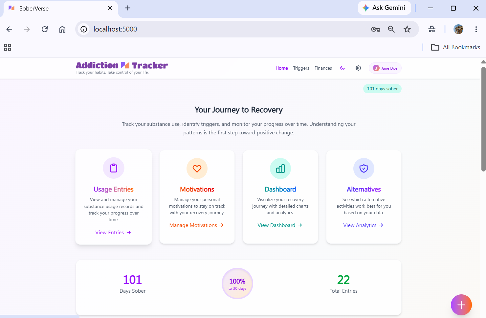
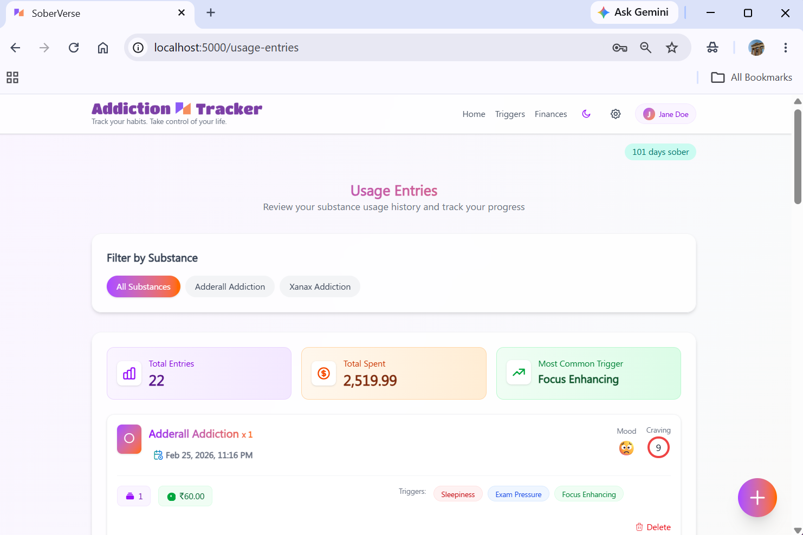
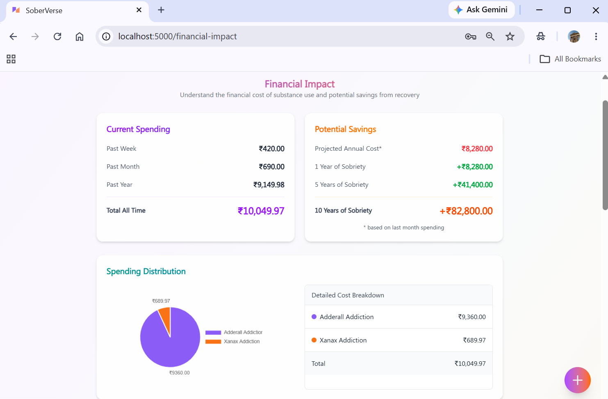
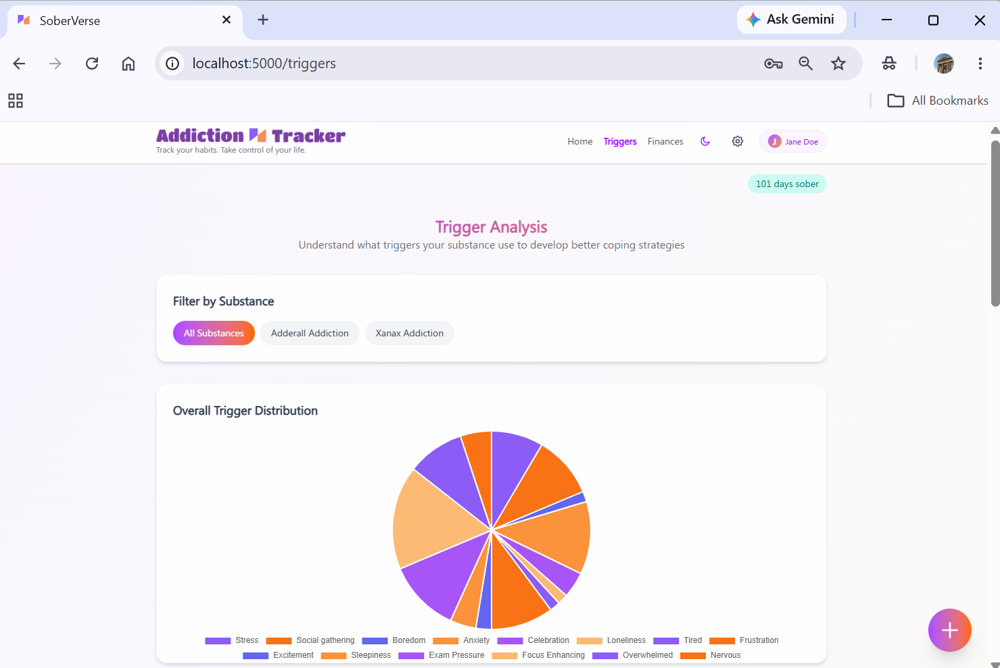
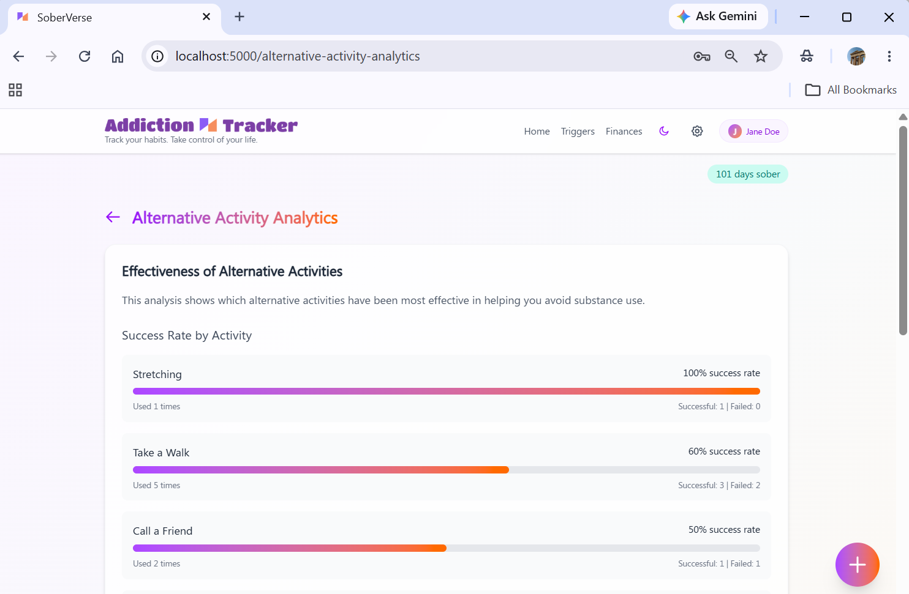
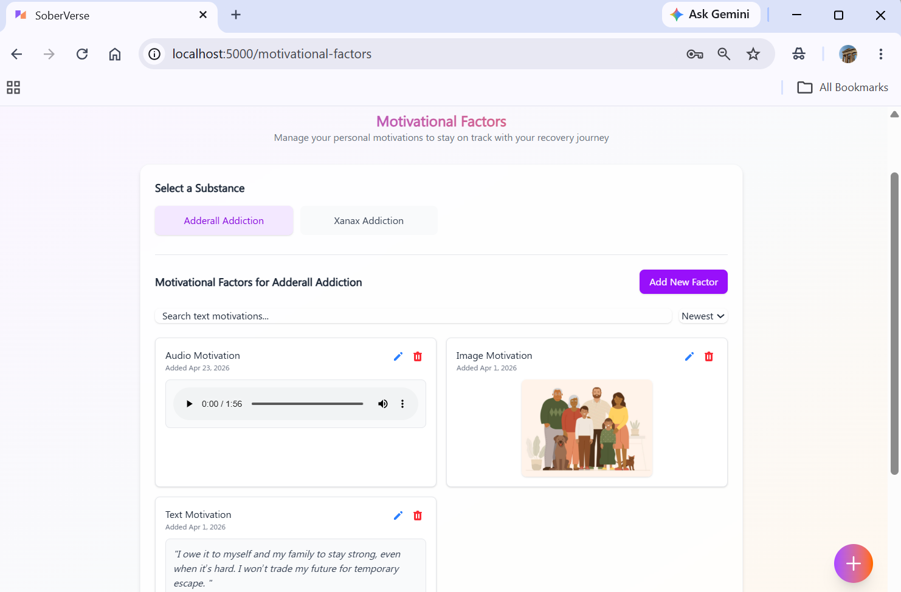

# SoberVerse

## Overview

SoberVerse is a desktop and web-based recovery tracking application designed to help users monitor substance use habits, understand triggers, track recovery progress, and build healthier routines.

The application provides analytics, motivation tracking, financial impact calculations, achievement systems, and recovery insights to support long-term behavioral change.

---

## Features

### Recovery Tracking
- Track substance usage history
- Monitor sobriety progress
- Record recovery milestones
- Analyze behavioral patterns

### Analytics & Insights
- Recovery Dashboard
- Usage Analytics
- Alternative Activity Analytics
- Financial Impact Tracking
- Progress Visualization
- Recovery Statistics

### Habit Management
- Substance Management
- Trigger Tracking
- Motivational Factors Tracking
- Achievement System
- Personalized Recovery Data

### Data Management
- Local Data Storage
- Backup & Restore Support
- Data Synchronization
- Secure User Authentication

---

## Screenshots

### Dashboard



### Usage Tracking



### Financial Impact



### Triggers



### Healthy Alternatives



### Motivational Factors



---

## Tech Stack

### Frontend
- Angular 20
- TypeScript
- Angular Material
- PrimeNG
- Tailwind CSS

### Desktop Framework
- Tauri
- Rust

### Data Storage
- Dexie.js
- IndexedDB

### Analytics & Visualization
- Chart.js
- Chart.js Data Labels

### Internationalization
- Transloco

---

## Project Structure

```bash
src/
├── app/
│   ├── pages/
│   │   ├── achievements/
│   │   ├── alternative-activity-analytics/
│   │   ├── financial-impact/
│   │   ├── motivational-factors/
│   │   ├── recovery-dashboard/
│   │   ├── settings/
│   │   ├── substances/
│   │   ├── triggers/
│   │   └── usage-entries/
│   │
│   ├── services/
│   ├── guards/
│   ├── models/
│   └── components/
│
└── environments/
```

---

## Installation

### Clone Repository

```bash
git clone https://github.com/harshithakanthamani/SoberVerse.git
```

### Navigate to Project

```bash
cd SoberVerse
```

### Install Dependencies

```bash
npm install
```

### Start Development Server

```bash
npm start
```

### Build Application

```bash
npm run build
```

---

## Running as a Desktop App

```bash
npm run tauri dev
```

Build desktop application:

```bash
npm run tauri build
```

---

## Key Modules

### Dashboard

Provides a high-level overview of recovery progress, streaks, usage trends, and important recovery statistics in a single view.

### Usage Tracking

Allows users to record substance usage events, monitor habits over time, and analyze behavioral patterns through detailed tracking.

### Financial Impact

Calculates the financial cost of substance use and highlights money saved throughout the recovery journey, helping users visualize tangible benefits.

### Triggers

Helps users identify and monitor situations, emotions, environments, or events that may lead to substance use, enabling better self-awareness and prevention.

### Healthy Alternatives

Encourages healthier coping mechanisms by tracking alternative activities that can replace substance use and contribute to long-term recovery.

### Motivational Factors

Stores personal motivations, goals, and reasons for recovery, providing a source of encouragement and accountability during challenging periods.

---

## Future Improvements

- Cloud synchronization
- Mobile companion application
- AI-powered recovery insights
- Community support features
- Goal planning system
- Smart notifications
- Health integrations

---

## Author

S Harshitha Kanthamani

GitHub: https://github.com/harshithakanthamani

---

## License

This project is licensed under the MIT License.
